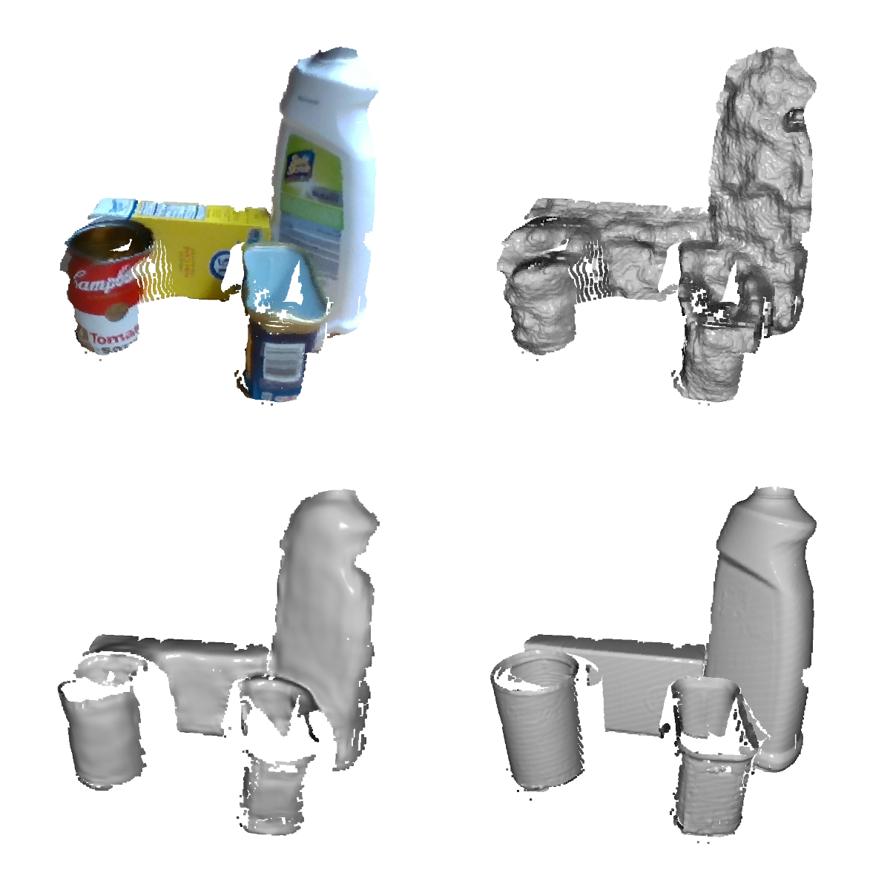

Self-Supervised Depth-Denoising of YCB Objects
==============================

Prediction result is displayed at the bottom left. Bottom right displays the HQ depth frame, top right the LQ depth frame.

- [Self-Supervised Depth-Denoising of YCB Objects](#self-supervised-depth-denoising-of-ycb-objects)
- [Environment](#environment)
  - [Create Environment](#create-environment)
  - [Update Environment](#update-environment)
  - [Export Environment](#export-environment)
- [Resources](#resources)
- [Project Structure](#project-structure)
- [Dataset Generation](#dataset-generation)
  - [Retrieve Images for Calibration](#retrieve-images-for-calibration)
  - [Compute Extrinsic Calibration](#compute-extrinsic-calibration)
    - [CharuCo](#charuco)
    - [Manual Feature Picking](#manual-feature-picking)
  - [Retrieve Dataset](#retrieve-dataset)
  - [Calibrate Dataset](#calibrate-dataset)
  - [Compute Masks for Dataset](#compute-masks-for-dataset)
    - [With Custom Algorithm](#with-custom-algorithm)
    - [With MaskRCNN](#with-maskrcnn)
  - [Augment Dataset](#augment-dataset)
    - [Augment in 3D **preferred**](#augment-in-3d-preferred)
    - [Augment by Mask (deprecated)](#augment-by-mask-deprecated)
  - [Generate JSONs to split Dataset into train/val/test set](#generate-jsons-to-split-dataset-into-trainvaltest-set)
  - [Compute Bounds for Depth Normalization](#compute-bounds-for-depth-normalization)
- [Training](#training)
  - [Hyperparameter Tuning](#hyperparameter-tuning)
- [Evaluation](#evaluation)
  - [Run Evaluation](#run-evaluation)
  - [Plot Evaluation](#plot-evaluation)
- [BwUniCluster 2.0](#bwunicluster-20)

Environment
=====

The project consists of two stages, namely:
- dataset
- training

Those stages have their own [conda](https://anaconda.org) environment, to reduce
the size of each environment and prevent dependency conflicts (especially with
different python versions).

Create Environment
-----

To create the dataset environment, reasure the [Zivid SDK
v2.5.0](https://www.zivid.com/downloads) is installed on your system. Otherwise
the creation might fail.

To create a specific conda environment, there are .yml files located in
[envs](./envs), that should be used. All files are named
*depth-denoising_%STAGE%.yml*, where *%STAGE%* must be replaced with one of the
stages listed above. To ensure all notebooks execute correctly, the last command
given below adds the PYTHONPATH environment variable pointing to the src folder
of the repository.

To create an environment execute following commands 
```bash
conda env create -f ./envs/depth-denoising_%STAGE%.yml 
conda activate depth-denoising_%STAGE%
conda env config vars set PYTHONPATH=$PWD/src
```

E.g. to generate the environment for *training*, execute:
```bash
conda env create -f ./envs/depth-denoising_training.yml
conda activate depth-denoising_training
conda env config vars set PYTHONPATH=$PWD/src
```

Update Environment
------------------

To update the created environment with the respective environment YAML file,
execute:
```bash
conda env update --file ./envs/depth-denoising_%STAGE%.yml
```

Export Environment
------------------

After changes are made to one of the environments, ensure to also update the
respective YAML file.

Make sure you are in the correct conda environment
```bash
conda activate depth-denoising_%STAGE%
```

Execute following command to export currently used conda and pip packages 
```bash
conda env export > ./envs/depth-denoising_%STAGE%.yml
```

Resources
===

All resources of this repository are stored in [dvc](https://dvc.org).
Therefore, they won't be downloaded when cloning the repository. To clone them,
dvc and dvc-ssh must be installed on the system. Visit
[https://dvc.org/doc/install](https://dvc.org/doc/install) for further
information. They might be already installed in one of the conda environments.

When dvc and dvc-ssh is installed, the resources can be pulled with following
command
```bash
dvc pull
```

**Note: The used dvc remote server isn't available to the public.**

Project Structure 
====

    ├── LICENSE
    ├── Makefile           <- Makefile with commands like `make data` or `make train`
    ├── README.md          <- The top-level README for developers using this project.
    ├── docs               <- A default Sphinx project; see sphinx-doc.org for details
    ├── envs               <- Conda environments
    ├── notebooks          <- Jupyter notebooks. Naming convention is a number (for ordering),
    │                         the creator's initials, and a short `-` delimited description, e.g.
    │                         `1.0-jqp-initial-data-exploration`.
    ├── resources          <- Trained and serialized models, all datasets
    ├── setup.py           <- makes project pip installable (pip install -e .) so src can be imported
    ├── src                <- Source code for use in this project.
    │   ├── _old           <- old code
    │   ├── calibrate      <- files to calibrate frames
    │   │   └── calib_in_pcd.py
    │   ├── camera_interfaces <- interfaces to talk to cameras
    │   ├── dataset        <- Dataset management files
    │   ├── evaluate       <- Scripts to evaluate trained models
    │   ├── models         <- UNet model classes
    │   ├── networks       <- UNet and LSTMUNet model classes
    │   ├── segmentation   <- files to segment YCB dataset
    │   ├── trainers       <- Out-Of-Fold and Basic trainer to train models
    │   ├── utils          <- utils


Dataset Generation
===

The dataset generation includes multiple steps to retrieve a good enough result. The steps including actual dataset recording should be executed in the `depth-denoising_dataset` conda environment. The other steps should be executed in the `depth-denoising_training` environment.

1. Retrieve Images for Calibration
1. Compute Extrinsics Calibration
1. Retrieve Dataset
1. Calibrate Dataset
1. Compute Masks for Dataset
1. Augment Dataset
1. Generate JSONs to split Dataset into train/val/test set

The resulting dataset can be used to train and evaluate the network.

Retrieve Images for Calibration
---

At first, the cameras must be calibrated to each other. Therefore, multiple
frames must be recorded, with the help of which the calibration can be computed.
What frames must be recorded depends on the calibration method.
- For CharuCo Board calibration, capture frames of a CharuCo Board.
- For Manual Feature Picking, capture frames where features can later be picked
manually rather easy.

For the capture process, use the notebook
[00_retrieve_datset.ipynb](notebooks/00_retrieve_dataset.ipynb). This notebook
helps immensely to generate pairs of LQ- and HQ RGB and depth frames.

Compute Extrinsic Calibration
---

There exist two methods to compute the extrinsic transformation matrix that
maps the frame of the HQ camera plane onto the LQ camera's plane.

- CharuCo (**preferred**)
- Manual Feature Picking

Both methods print out the resulting transformation matrix. The matrix must be
saved for later.

### CharuCo
This method has the benefit, that the calibration can be automated fully. For
computing the extrinsic transformation matrix with this method, the script
[charuco_compute_extrinsic_transform.py](src/data_processing/charuco_compute_extrinsic_transform.py)
should be used.
```bash
python src/data_processing/charuco_compute_extrinsic_transform.py %DIR_TO_FILES%
```
The placeholder `$DIR_TO_FILES$` must be replaced with the directory the charuco
dataset is located in. The script will print out the final transformation matrix
at the end.

### Manual Feature Picking
This method requires a human to select corresponding features in the point
clouds of the cameras images. Use the script
[manual_compute_extrinsic_transform.py](src/data_processing/manual_compute_extrinsic_transform.py)
to compute the transformation matrix. This script will prompt two visualization
sequentially. The user must select corresponding points in both point clouds. To
select a point use the Open3D commands, also listed in the respective
documentation. **The order in which the points are selected matter.** The
transformation matrix will be computed to minimize the square distance of the
point pairs selected. The resulting transformation matrix will be printed to
stdout at the end of the script.

Retrieve Dataset
---
When the calibration is computed, the first dataset can be recorded. For the
capture process, use again the notebook
[00_retrieve_datset.ipynb](notebooks/00_retrieve_dataset.ipynb).

Calibrate Dataset
---
This step aligns the RGB and depth images of the HQ and LQ cameras with the
earlier computed extrinsic transformation matrix. The script
[calib_in_pcd.py](src/data_processing/calib_in_pcd.py) should be used to
calibrate a dataset. At the top of the script (~ line 16), the transformation
matrix is hard-coded. This transformation matrix should be replaced with the
one computed in the step before. The script has multiple parameters.
- *$INPUT_DIR%*: The first positional parameter is the input directory where
the raw files are located that should be computed.
- *$OUTPUT_DIR%*: The second is the output directory the calibrated files are
saved to. The file structure (including the file naming) of the input directory
will be mirrored to the output directory. Therefore, file
`%INPUT_DIR%/DIR_1/file.npz` will later be located in
`%OUTPUT_DIR%/DIR_1/file.npz`.
- *--jobs*: number of jobs
- *-cropped*: if the calibrated images should be cropped so that no black pixels
    are visible, or the images should be the same as the original, LQ image
    view.
- *--debug*: displays visualizations of the point clouds before and after
  calibration.

Compute Masks for Dataset
---
There are two ways to compute masks for a YCB Dataset. 
- **With custom algorithm (preferred)**
- With MaskRCNN
The first one is preferred, as it generates more precise masks.

### With Custom Algorithm
To compute the masks with the custom algorithm, use the script [region_growing_segmentation.py](src/data_processing/segmentation/region_growing_segmentation.py). The first two positional arguments are the input and output directory. The number of jobs can be defined with `--jobs`.
The script requires two files that contain the scene bounding box and the list of points that should be filtered out. The paths to those two files are hard-coded. [get_points_of_pcd_picels.py](src/scripts/get_points_of_pcd_pixels.py) can be used to retrieve points of the point cloud by selection.

### With MaskRCNN
To compute masks for the [YCB Video Dataset](https://rse-lab.cs.washington.edu/projects/posecnn/),
pull the submodule located at [3rdparty/mask_rcnn](3rdparty/mask_rcnn).
Follow the respective readme to get a trained model of the MaskRCNN on the 
YCB Video Dataset.
Afterwards masks for the own dataset can be computed with the help of the script
[mask_rcnn_segmentation.py](src/data_processing/mask_rcnn_segmentation.py).
The script can be executed the following:
```bash
python mask_rcnn_segmentation.py %INPUT_DIR% %OUTPUT_DIR%
```
The first two parameters must be present.
The first parameter `%INPUT_DIR%` points to the directory the dataset is located where the mask should be computed for.
The computed masks will be saved into the path given by the parameter `%OUTPUT_DIR%`.

**Note: There are currently multiple, hard-coded paths in the script. Those match up, if the mask_rcnn repo is setup as in the respective README described. Otherwise, the paths must be changed.**

For further parameter informations execute:
```bash
python mask_rcnn_segmentation.py -h
```

Augment Dataset
---
There exist two types of augmentations, whereby the `Augment in 3D` is preferred, as it generates better training data.

### Augment in 3D **preferred**
This augmentation technique rotates and translates the input images in 3D within some bounds. 
Use [augment_in_3d.py](src/data_processing/augment_in_3d.py) to generate the augmentations.
The first two positional parameters must be input and output directory paths. The number of augmentations per image can be set with `--num-augs`, defaulting to 5. Parallelization is possible by setting `--jobs` to the number of threads.

### Augment by Mask (deprecated)
Since it is time-consuming to record a large enough dataset for training, data
augmentation can be applied. The augmentation works the following: With the help
of the previous step, each image pair also has the masks computed for each
object detected in the image. These masks are used to generate multiple images
for each image. It works the following: It generates all combinations of masks
and applied the union of those masks on the image (sets regions outside the
masks to NaN). This generates for an image with 5 objects and therefore 5 masks
5! - 1= 121 images. The script to use is
[augment_by_mask.py](src/data_processing/augment_by_mask.py). The parameters to
pass to the script are self-explanatory. The generated augmentations for an
image with name %NAME% are named %NAME%_n, whereby n indicates the n-th
augmentation of this image. 

**NOTE: After this step, the augmented images won't have any background
information. A not masked image is currently not added to the augmentation.**

Generate JSONs to split Dataset into train/val/test set
---

To have always the same, but initially randomly split sets,
the script [generate_sets.py](src/data_processing/generate_sets.py) can be executed.
This script will collect all paths to images in a given directory,
shuffle the list of paths and split it into train/val/test set.
The percentage, the test and val set will have can be configured via parameters.
The resulting split will be saved into three JSON files written to the dataset root.
Those JSON files have all the same structure.
They contain an absolute base path to the dataset and a list of paths relative to the base path
that point to the individual files.
Typically, the train and val set is used for training and valuation,
the test set is then later used for evaluation.

Compute Bounds for Depth Normalization
---

To improve training, it is possible to enable depth normalization.
This maps the depth values from [min_depth, max_depth] to [0, 1].
To compute min_depth, max_depth, use the script [compute_depth_bounds.py](src/scripts/compute_depth_bounds.py).
The script takes the directory containing the dataset and computes the maximum
and minimum depth values.
The values get printed to stdout at the end.

Training
===

Code from this section should be executed in the `depth-denoising_training` conda environment.
The main script to train the denoising model is
[train_models.py](src/trainers/train_models.py). To run the script execute
```bash
python train_models.py %CONFIG_PATH%
```
The training can be configured via a configuration script. A demo config file is
located in [src/trainers/config.yml](src/trainers/config.yml). There are two
trainers present to train a model.

- Out-Of-Fold Trainer
- Basic Trainer 

Each trainer can be activated/deactivated in the configuration
file. The configuration file contains many arguments that are explained in the
`config.yml` referenced before. The argument `%CONFIG_PATH%` must be replaced with
the path to the configuration file that should be used for training.

All paths in the config file, that should point to a dataset can either 
be directory or a file. If it's a directory, all .npz files in that directory will be used as dataset.
If it points to a (JSON) file, the files in that file fill form the dataset.

*Recommended:*

- The `train_path` should point to a `train_dataset.json`
- The `val_path` should point to a `val_dataset.json`
- The `dataset_path` should point to a `directory`, or `train_dataset.json`.

Hyperparameter Tuning
---
The hyperparameter tuning via random search can be started with [random_parameter_search.py](src/scripts/random_parameter_search.py). This will sample N different training configurations and train the model.
The first positional argument should point to the default config file to use. This config file will be used as base config file. All config parameters sampled from the random parameter search algorithm will overwrite the values from this base config file. `--num-configurations` indicates how many adaptations to generate for the base config. The generates adaptations will be saved to `--adaptations-file`. This allows to continue hyperparameter search after the script has terminated.

Evaluation
===

Code from this section should be executed in the `depth-denoising_training` conda environment.

Run Evaluation
----
To evaluate a trained model, it is recommended to use the `test_dataset.json` of the
dataset.
To test the model and generate evaluation metrics, use the script [evaluate.py](src/evaluate/evaluate.py)
The script can be executed the following:
```bash
python evaluate.py %MODEL_PATH%
```

%MODEL_PATH% must point to a directory. 
The script will then gather all direct subdirectories in this directory.
The relative path to the subdirectory will act as model name.
All files like e%EPOCH%.pth will be interpreted as a snapshot of the model.

The evaluation will use the stored config.yml in the model directory. The dataset for evaluation will be set to equal the train dataset specified in the config.yml, but with test_dataset.json as file name.

If the argument `--all-epochs` is passed, all epochs of a model will be evaluated.
Otherwise, the snapshot with the epoch will be evaluated only.
The evaluation results will be saved to a JSON file in the `%MODEL_PATH%` directory.

Plot Evaluation
---
The script [plot_evaluation.py](src/evaluate/plot_evaluation.py) can be used for evaluation plotting.
Per default, this script generates diagrams containing 5 Box plots each. 
A hard-coded flag can be changed to generate bar plots instead.
The script tasks the path to the JSON file, generated in the previous step, as input.
The resulting plot will be printed as `plt.png` to the JSONs directory.

BwUniCluster 2.0
====

There are multiple scripts located in models, that might be helpful to train all
the models on the BwUniCluster 2.0. To enqueue the training step execute
following command in the 

    sbatch ./models/enqueue_job.sh

To test the training, one can execute following command to queue the training on
a dev node

    sbatch ./models/enqueue_dev_job.sh

The process will be logged into `train_models.out`

For further information, visit
[https://wiki.bwhpc.de/e/BwUniCluster_2.0_Slurm_common_Features](https://wiki.bwhpc.de/e/BwUniCluster_2.0_Slurm_common_Features)


Citing
====

If you use this library in an academic context, please cite the following publication:

```bash
@misc{kienle2023multiobject,
      title={Multi-Object Self-Supervised Depth Denoising}, 
      author={Claudius Kienle and David Petri},
      year={2023},
      eprint={2305.05778},
      archivePrefix={arXiv},
      primaryClass={cs.LG}
}
```
